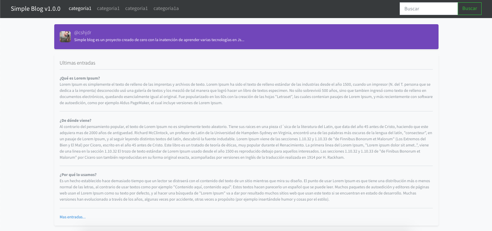
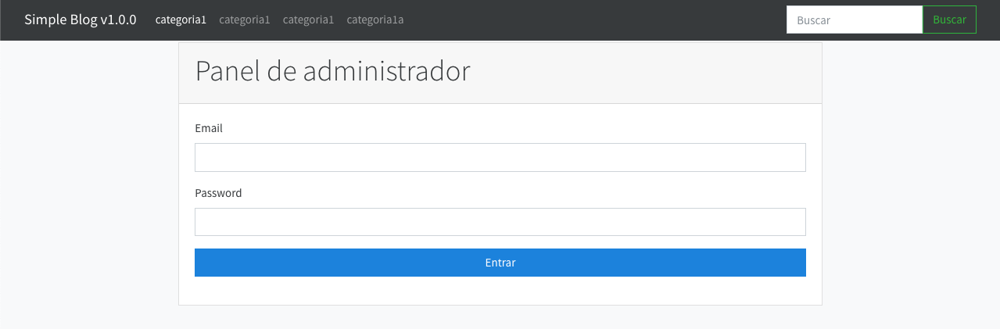
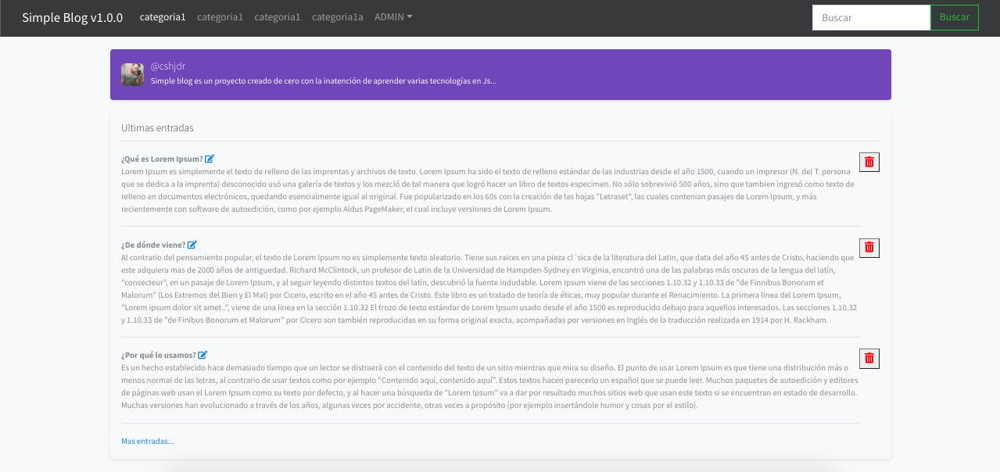
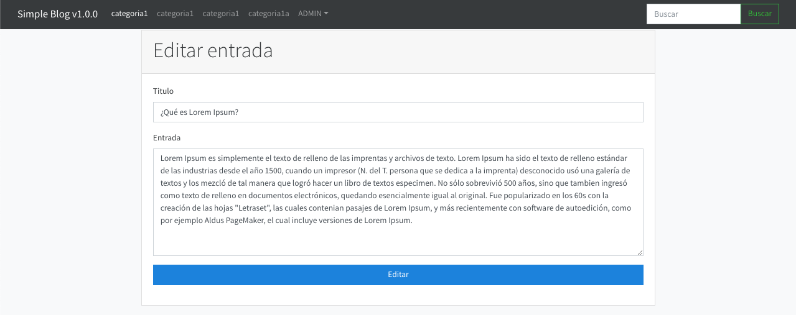

# Simple Blog v1.0.0
> Sistema de blog creado de cero con el simple afán de aprender, mejorar y añadir nuevas tecnologías. La idea principal es hacer algo similar a WordPress pero de bajo presupuesto 😂 

# Imágenes

# Tecnologías/Módulos/Frameworks utilizados 
- javascript
- html/css/bootstrap
- express 
- connect-flash 
- bcryptjs 
- express-handlebars 
- express-session 
- method-override 
- mongoose 
- passport 
- passport-local

# Proximamente
- Paginación
- [x] Entrada entera por ID
- Categorías relacionadas a la entrada
- Nube de tags
- Mas validaciones
- Buscador
- Elección y mejoras de estilos principales
- Sistema para subir estilos propios
